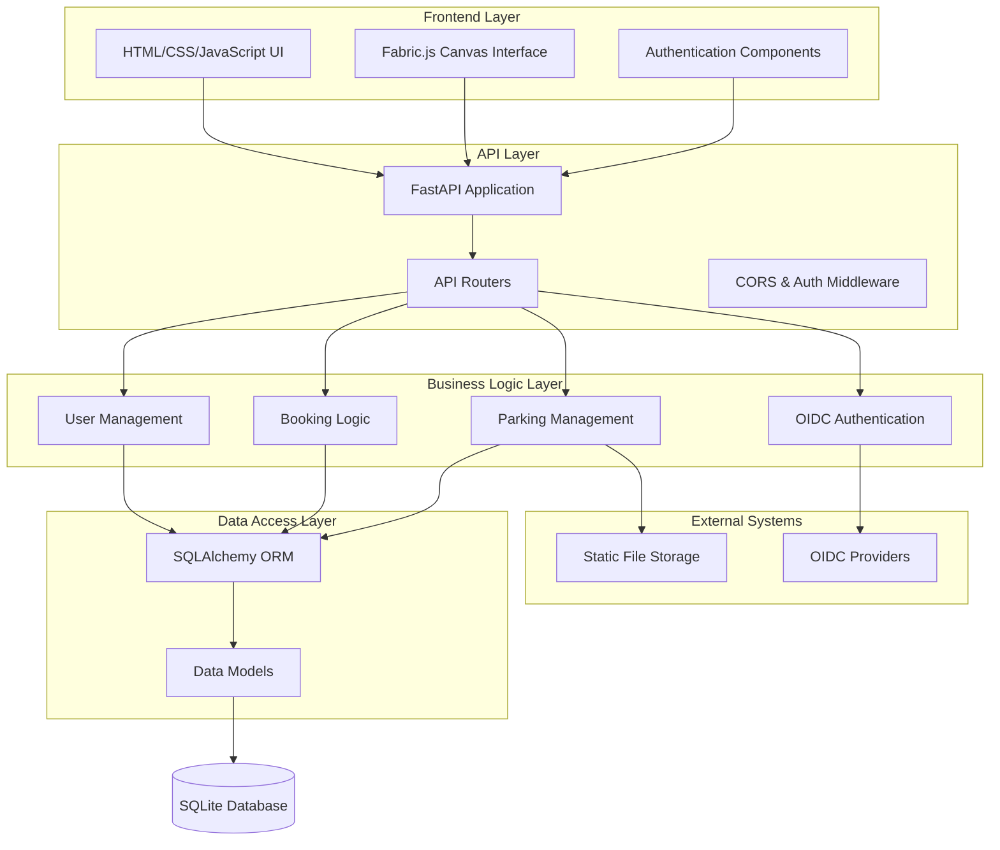
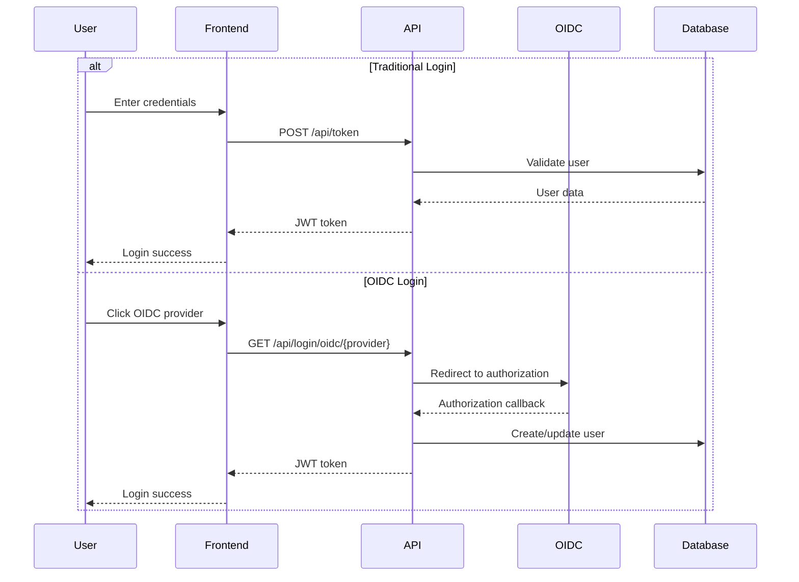
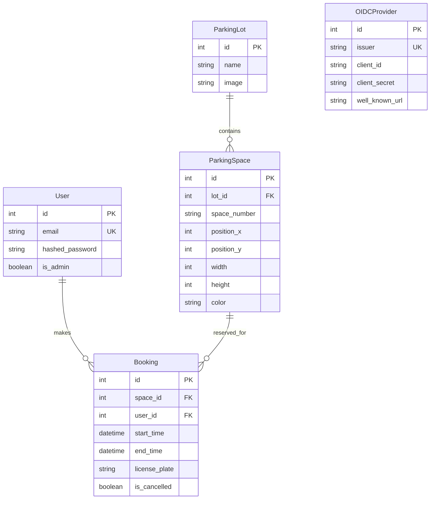

# Design Document

## Overview

The Parking Booking System is a web-based application built with FastAPI backend and vanilla JavaScript frontend that enables users to visually book parking spaces in various parking lots. The system features a canvas-based interface for interactive parking lot management, comprehensive user authentication including OIDC integration, and role-based access control for administrative functions.

The application follows a layered architecture with clear separation between presentation, business logic, and data access layers. It uses SQLAlchemy for ORM, JWT for authentication, and Fabric.js for canvas-based visual interactions.

## Architecture

### System Architecture



### Authentication Flow



## Components and Interfaces

### Core Components

#### 1. Authentication System
- **JWT Token Management**: Handles token creation, validation, and expiration
- **Password Hashing**: Uses bcrypt for secure password storage
- **OIDC Integration**: Supports multiple external identity providers
- **Role-Based Access Control**: Distinguishes between regular users and administrators

#### 2. User Management
- **User Registration**: Creates new user accounts with email validation
- **Profile Management**: Handles user information and preferences
- **Admin User Management**: Administrative functions for user CRUD operations
- **License Plate History**: Tracks and suggests previously used license plates

#### 3. Parking Lot Management
- **Visual Lot Editor**: Canvas-based interface for creating and editing parking spaces
- **Image Management**: Handles background images for parking lots (upload and URL)
- **Space Configuration**: Manages parking space properties (position, size, color)
- **Lot CRUD Operations**: Administrative functions for parking lot management

#### 4. Booking System
- **Availability Checking**: Real-time availability validation for time ranges
- **Booking Creation**: Creates reservations with conflict detection
- **Booking Management**: View, filter, and cancel existing bookings
- **Time Validation**: Ensures booking times are logical and non-conflicting

#### 5. Canvas Interface
- **Interactive Space Selection**: Click-to-select parking spaces
- **Visual Availability Display**: Color-coded space availability
- **Responsive Design**: Adapts to different screen sizes
- **Real-time Updates**: Reflects booking changes immediately

### API Interface Design

#### Authentication Endpoints
```
POST /api/token - Traditional login
GET /api/login/oidc/{provider} - OIDC login initiation
GET /api/auth/oidc/{provider} - OIDC callback handling
```

#### User Management Endpoints
```
POST /api/users/ - User registration
GET /api/users/me - Current user profile
GET /api/users/me/license-plates - User's license plate history
GET /api/admin/users - List all users (admin)
POST /api/admin/users - Create user (admin)
PUT /api/admin/users/{id}/set-admin - Set admin status (admin)
DELETE /api/admin/users/{id} - Delete user (admin)
```

#### Parking Management Endpoints
```
GET /api/parking-lots/ - List parking lots
GET /api/parking-lots/{id} - Get specific lot
GET /api/parking-lots/{id}/spaces/ - Get lot spaces
GET /api/parking-lots/{id}/spaces/availability - Check availability
POST /api/admin/parking-lots/ - Create parking lot (admin)
PUT /api/admin/parking-lots/{id} - Update parking lot (admin)
DELETE /api/admin/parking-lots/{id} - Delete parking lot (admin)
```

#### Booking Endpoints
```
POST /api/bookings/ - Create booking
GET /api/bookings/ - User's bookings
GET /api/bookings/all - All bookings (admin)
PUT /api/bookings/{id}/cancel - Cancel booking
```

#### OIDC Management Endpoints
```
POST /api/admin/oidc/ - Add OIDC provider (admin)
GET /api/admin/oidc/ - List OIDC providers (admin)
DELETE /api/admin/oidc/{id} - Remove OIDC provider (admin)
```

## Data Models

### Database Schema



### Data Validation Rules

#### User Data
- Email must be unique and valid format
- Password must be hashed using bcrypt
- Admin status defaults to false

#### Parking Space Data
- Position coordinates must be positive integers
- Dimensions (width/height) must be positive integers
- Color must be valid hex color code
- Space number must be unique within a parking lot

#### Booking Data
- Start time must be before end time
- No overlapping bookings for the same space
- License plate format validation
- Time slots must be in the future (for new bookings)

## Error Handling

### Error Response Format
```json
{
    "detail": "Error message",
    "status_code": 400,
    "error_type": "validation_error"
}
```

### Error Categories

#### Authentication Errors (401)
- Invalid credentials
- Expired tokens
- Missing authentication

#### Authorization Errors (403)
- Insufficient permissions
- Admin-only access attempts

#### Validation Errors (400)
- Invalid input data
- Business rule violations
- Booking conflicts

#### Not Found Errors (404)
- Non-existent resources
- Invalid IDs

#### Server Errors (500)
- Database connection issues
- External service failures
- Unexpected exceptions

### Error Handling Strategy

1. **Input Validation**: Pydantic schemas validate all input data
2. **Business Logic Validation**: Custom validators check business rules
3. **Database Constraints**: SQLAlchemy enforces data integrity
4. **Exception Handling**: Global exception handlers provide consistent responses
5. **Logging**: All errors are logged with appropriate detail levels

## Testing Strategy

### Unit Testing
- **Model Testing**: Validate data model behavior and constraints
- **Service Logic Testing**: Test business logic components in isolation
- **Authentication Testing**: Verify JWT and OIDC authentication flows
- **Validation Testing**: Test input validation and error handling

### Integration Testing
- **API Endpoint Testing**: Test complete request/response cycles
- **Database Integration**: Test ORM operations and transactions
- **OIDC Integration**: Test external authentication provider integration
- **File Upload Testing**: Test image upload and storage functionality

### End-to-End Testing
- **User Workflows**: Test complete user booking workflows
- **Admin Workflows**: Test administrative management workflows
- **Canvas Interactions**: Test visual parking space selection and booking
- **Multi-user Scenarios**: Test concurrent booking attempts and conflicts

### Performance Testing
- **Database Query Performance**: Optimize complex queries for booking availability
- **Canvas Rendering Performance**: Test large parking lot visualization
- **Concurrent User Testing**: Test system behavior under load
- **File Upload Performance**: Test image upload and processing speed

### Security Testing
- **Authentication Security**: Test JWT token security and OIDC flows
- **Authorization Testing**: Verify role-based access controls
- **Input Sanitization**: Test against injection attacks
- **File Upload Security**: Test image upload security and validation