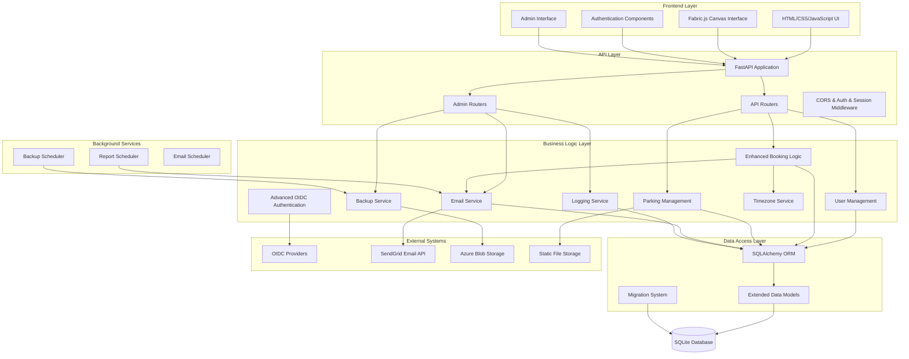
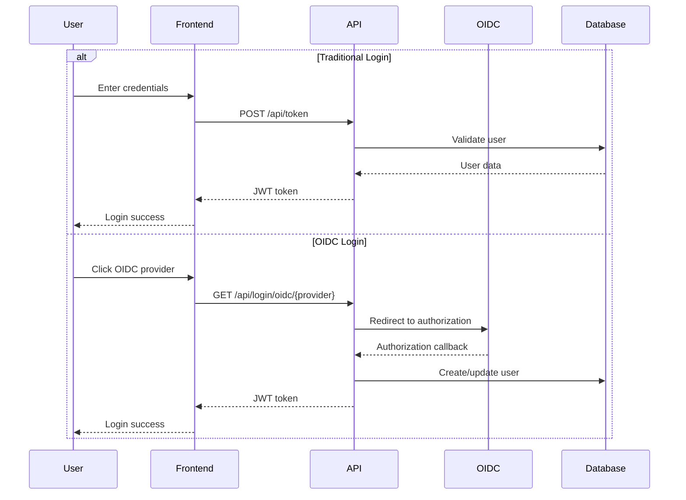
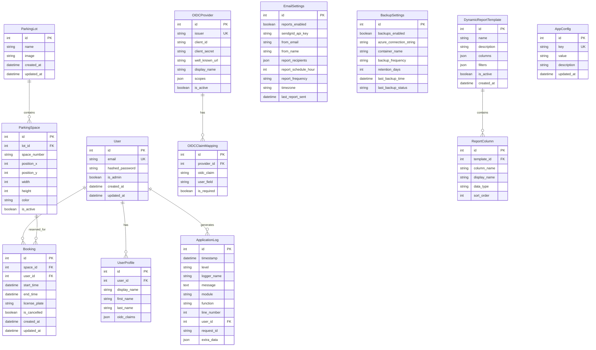

# Design Document

## Overview

The Parking Booking System is a comprehensive web-based application built with FastAPI backend and vanilla JavaScript frontend that enables users to visually book parking spaces in various parking lots. The system has evolved into a full-featured enterprise parking management solution with canvas-based interface for interactive parking lot management, comprehensive user authentication including advanced OIDC integration, role-based access control, automated reporting, database backups, comprehensive logging, timezone-aware operations, and extensive customization capabilities.

The application follows a layered architecture with clear separation between presentation, business logic, and data access layers. It uses SQLAlchemy for ORM, JWT for authentication, Fabric.js for canvas-based visual interactions, SendGrid for email services, Azure Blob Storage for backups, and includes a sophisticated background scheduler for automated operations.

## Architecture

### System Architecture



### Authentication Flow



## Components and Interfaces

### Core Components

#### 1. Enhanced Authentication System
- **JWT Token Management**: Handles token creation, validation, expiration, and refresh
- **Password Hashing**: Uses bcrypt for secure password storage
- **Advanced OIDC Integration**: Supports multiple external identity providers with claims mapping
- **Role-Based Access Control**: Distinguishes between regular users and administrators
- **Session Management**: Handles both JWT and session-based authentication
- **Claims Mapping**: Configurable mapping of OIDC claims to user attributes

#### 2. Comprehensive User Management
- **User Registration**: Creates new user accounts with email validation
- **Profile Management**: Handles user information, preferences, and OIDC claims
- **Admin User Management**: Administrative functions for user CRUD operations
- **License Plate History**: Tracks and suggests previously used license plates
- **User Deletion**: Cascade deletion with foreign key constraint handling
- **User Analytics**: Tracking and reporting on user activity

#### 3. Advanced Parking Lot Management
- **Visual Lot Editor**: Canvas-based interface for creating and editing parking spaces
- **Image Management**: Handles background images for parking lots (upload and URL)
- **Space Configuration**: Manages parking space properties (position, size, color)
- **Lot CRUD Operations**: Administrative functions for parking lot management
- **Space Analytics**: Utilization tracking and reporting
- **Bulk Operations**: Mass updates and configuration changes

#### 4. Enhanced Booking System
- **Advanced Availability Checking**: Real-time availability validation with timezone awareness
- **Conflict Resolution**: Intelligent booking creation with conflict detection and suggestions
- **Booking Management**: View, filter, cancel, and modify existing bookings
- **Business Rules Validation**: Comprehensive validation including duration limits, advance booking limits
- **Booking Analytics**: Detailed reporting and statistics
- **Email Confirmations**: Automated booking confirmation emails

#### 5. Responsive Canvas Interface
- **Interactive Space Selection**: Click-to-select parking spaces with real-time feedback
- **Visual Availability Display**: Color-coded space availability with license plate display
- **Responsive Design**: Adapts to different screen sizes and devices
- **Real-time Updates**: Reflects booking changes immediately
- **Touch Support**: Mobile-friendly touch interactions
- **Accessibility Features**: Keyboard navigation and screen reader support

#### 6. Email Service System
- **SendGrid Integration**: Professional email delivery via SendGrid API
- **Booking Confirmations**: Automated confirmation emails for new bookings
- **Scheduled Reports**: Automated daily/weekly/monthly booking reports
- **Dynamic Templates**: Configurable email templates with custom data
- **Timezone-Aware Formatting**: Proper timezone handling in email content
- **Delivery Tracking**: Email delivery status monitoring and logging

#### 7. Backup and Recovery System
- **Azure Blob Storage Integration**: Cloud-based backup storage
- **Automated Scheduling**: Configurable backup frequency (daily/weekly/monthly)
- **Database Compression**: Efficient backup file compression
- **Backup Monitoring**: Status tracking and failure notifications
- **Recovery Tools**: Database restoration capabilities
- **Retention Management**: Automated cleanup of old backups

#### 8. Comprehensive Logging System
- **Database Logging**: All application logs stored in database
- **Structured Logging**: Consistent log format with context information
- **Admin Interface**: Web-based log viewing with filtering and search
- **Log Analytics**: Statistics and trending analysis
- **Performance Monitoring**: Request timing and performance metrics
- **Security Auditing**: Authentication and authorization event logging

#### 9. Timezone Management Service
- **Global Timezone Support**: Comprehensive timezone handling across the application
- **Configurable System Timezone**: Admin-configurable default timezone
- **Consistent Formatting**: Standardized date/time display formats
- **Business Hours Validation**: Timezone-aware booking time validation
- **Scheduler Integration**: Proper timezone handling for automated tasks
- **User Experience**: Intuitive timezone selection and display

#### 10. Background Scheduler System
- **Multi-Task Scheduling**: Handles email reports, backups, and maintenance tasks
- **Timezone-Aware Execution**: Respects configured timezone for scheduling
- **Error Handling**: Robust error handling with retry logic
- **Status Monitoring**: Real-time status tracking and reporting
- **Graceful Shutdown**: Proper cleanup on application shutdown
- **Performance Optimization**: Efficient task execution and resource management

#### 11. Dynamic Reporting System
- **Template Management**: Configurable report templates with custom columns
- **Flexible Filtering**: Advanced filtering options for report data
- **Multiple Formats**: Support for CSV, Excel, and other export formats
- **Scheduled Delivery**: Automated report generation and email delivery
- **Report Analytics**: Usage tracking and performance metrics
- **Custom Branding**: Branded report templates with organization styling

#### 12. Styling and Customization System
- **Theme Management**: Configurable color schemes and branding
- **Logo Customization**: Custom logo upload and management
- **Responsive Styling**: Consistent styling across all device types
- **Real-time Preview**: Live preview of styling changes
- **Brand Consistency**: Coordinated styling across all application components
- **Accessibility Compliance**: WCAG-compliant styling options

### API Interface Design

#### Authentication Endpoints
```
POST /api/token - Traditional login with JWT token generation
POST /api/token/refresh - JWT token refresh
GET /api/login/oidc/{provider} - OIDC login initiation
GET /api/auth/oidc/{provider} - OIDC callback handling
GET /api/oidc/providers - Public OIDC provider list
POST /api/logout - Logout with token invalidation
```

#### User Management Endpoints
```
POST /api/users/ - User registration with validation
GET /api/users/me - Current user profile with OIDC claims
GET /api/users/me/license-plates - User's license plate history
PUT /api/users/me - Update user profile
GET /api/admin/users - List all users with pagination (admin)
POST /api/admin/users - Create user with role assignment (admin)
PUT /api/admin/users/{id} - Update user details (admin)
PUT /api/admin/users/{id}/set-admin - Set admin status (admin)
DELETE /api/admin/users/{id} - Delete user with cascade handling (admin)
GET /api/admin/users/{id}/bookings - User's booking history (admin)
```

#### Parking Management Endpoints
```
GET /api/parking-lots/ - List parking lots with metadata
GET /api/parking-lots/{id} - Get specific lot with spaces
GET /api/parking-lots/{id}/spaces/ - Get lot spaces with current status
GET /api/parking-lots/{id}/spaces/availability - Check availability with timezone
POST /api/admin/parking-lots/ - Create parking lot with image upload (admin)
PUT /api/admin/parking-lots/{id} - Update parking lot (admin)
DELETE /api/admin/parking-lots/{id} - Delete parking lot (admin)
POST /api/admin/parking-lots/{id}/spaces - Create parking space (admin)
PUT /api/admin/parking-lots/{id}/spaces/{space_id} - Update parking space (admin)
DELETE /api/admin/parking-lots/{id}/spaces/{space_id} - Delete parking space (admin)
```

#### Enhanced Booking Endpoints
```
POST /api/bookings/ - Create booking with conflict resolution
GET /api/bookings/ - User's bookings with filtering
GET /api/bookings/{id} - Get specific booking details
PUT /api/bookings/{id} - Update booking with validation
PUT /api/bookings/{id}/cancel - Cancel booking
GET /api/admin/bookings - All bookings with advanced filtering (admin)
GET /api/admin/bookings/export - Export bookings to CSV/Excel (admin)
GET /api/admin/bookings/stats - Booking statistics and analytics (admin)
POST /api/admin/bookings/{id}/force-cancel - Force cancel booking (admin)
```

#### OIDC Management Endpoints
```
POST /api/admin/oidc/ - Add OIDC provider with validation (admin)
GET /api/admin/oidc/ - List OIDC providers with status (admin)
PUT /api/admin/oidc/{id} - Update OIDC provider configuration (admin)
DELETE /api/admin/oidc/{id} - Remove OIDC provider (admin)
POST /api/admin/oidc/{id}/test - Test OIDC provider connection (admin)
GET /api/admin/oidc-claims/ - List available OIDC claims (admin)
POST /api/admin/oidc-claims/ - Create claims mapping (admin)
PUT /api/admin/oidc-claims/{id} - Update claims mapping (admin)
DELETE /api/admin/oidc-claims/{id} - Delete claims mapping (admin)
```

#### Email and Reporting Endpoints
```
GET /api/admin/email-settings - Get email configuration (admin)
PUT /api/admin/email-settings - Update email settings (admin)
POST /api/admin/email-settings/test - Test email configuration (admin)
POST /api/admin/reports/send - Send manual report (admin)
GET /api/admin/reports/templates - List report templates (admin)
POST /api/admin/reports/templates - Create report template (admin)
PUT /api/admin/reports/templates/{id} - Update report template (admin)
DELETE /api/admin/reports/templates/{id} - Delete report template (admin)
```

#### Backup Management Endpoints
```
GET /api/admin/backup-settings - Get backup configuration (admin)
PUT /api/admin/backup-settings - Update backup settings (admin)
POST /api/admin/backup/create - Create manual backup (admin)
GET /api/admin/backup/status - Get backup status and history (admin)
POST /api/admin/backup/test - Test backup configuration (admin)
DELETE /api/admin/backup/{id} - Delete specific backup (admin)
```

#### Logging and Monitoring Endpoints
```
GET /api/admin/logs - Get application logs with filtering (admin)
GET /api/admin/logs/levels - Get available log levels (admin)
GET /api/admin/logs/loggers - Get available logger names (admin)
GET /api/admin/logs/stats - Get log statistics (admin)
DELETE /api/admin/logs/cleanup - Cleanup old logs (admin)
GET /api/admin/system/status - Get system status and health (admin)
GET /api/admin/system/metrics - Get performance metrics (admin)
```

#### Configuration Management Endpoints
```
GET /api/admin/timezone-settings/timezones - Get available timezones (admin)
GET /api/admin/timezone-settings/current - Get current timezone (admin)
PUT /api/admin/timezone-settings - Update system timezone (admin)
GET /api/admin/styling-settings - Get styling configuration (admin)
PUT /api/admin/styling-settings - Update styling settings (admin)
POST /api/admin/styling-settings/logo - Upload custom logo (admin)
DELETE /api/admin/styling-settings/logo - Remove custom logo (admin)
```

#### Migration and Maintenance Endpoints
```
GET /api/admin/migrations/status - Get migration status (admin)
POST /api/admin/migrations/run - Run pending migrations (admin)
POST /api/admin/migrations/rollback - Rollback last migration (admin)
GET /api/admin/maintenance/cleanup - Get cleanup recommendations (admin)
POST /api/admin/maintenance/cleanup - Run data cleanup (admin)
GET /api/admin/maintenance/integrity - Check data integrity (admin)
```

## Data Models

### Database Schema



### Data Validation Rules

#### User Data
- Email must be unique and valid format
- Password must be hashed using bcrypt
- Admin status defaults to false

#### Parking Space Data
- Position coordinates must be positive integers
- Dimensions (width/height) must be positive integers
- Color must be valid hex color code
- Space number must be unique within a parking lot

#### Booking Data
- Start time must be before end time
- No overlapping bookings for the same space
- License plate format validation
- Time slots must be in the future (for new bookings)

## Error Handling

### Error Response Format
```json
{
    "detail": "Error message",
    "status_code": 400,
    "error_type": "validation_error"
}
```

### Error Categories

#### Authentication Errors (401)
- Invalid credentials
- Expired tokens
- Missing authentication

#### Authorization Errors (403)
- Insufficient permissions
- Admin-only access attempts

#### Validation Errors (400)
- Invalid input data
- Business rule violations
- Booking conflicts

#### Not Found Errors (404)
- Non-existent resources
- Invalid IDs

#### Server Errors (500)
- Database connection issues
- External service failures
- Unexpected exceptions

### Error Handling Strategy

1. **Input Validation**: Pydantic schemas validate all input data
2. **Business Logic Validation**: Custom validators check business rules
3. **Database Constraints**: SQLAlchemy enforces data integrity
4. **Exception Handling**: Global exception handlers provide consistent responses
5. **Logging**: All errors are logged with appropriate detail levels

## Testing Strategy

### Unit Testing
- **Model Testing**: Validate data model behavior, constraints, and relationships including new models like ApplicationLog, BackupSettings, DynamicReportTemplate
- **Service Logic Testing**: Test business logic components including enhanced booking validation, email service, backup service, timezone service, and logging service
- **Authentication Testing**: Verify JWT and advanced OIDC authentication flows with claims mapping and token refresh
- **Validation Testing**: Test input validation, business rules, and comprehensive error handling across all components
- **Timezone Testing**: Validate timezone conversion and formatting across all components and services
- **Logging Testing**: Test structured logging, context preservation, and database storage functionality

### Integration Testing
- **API Endpoint Testing**: Test complete request/response cycles for all endpoints including new admin endpoints
- **Database Integration**: Test ORM operations, transactions, and migration scripts for all models
- **OIDC Integration**: Test external authentication provider integration with claims mapping and advanced configuration
- **Email Integration**: Test SendGrid integration, template rendering, scheduled reports, and delivery tracking
- **Backup Integration**: Test Azure Blob Storage integration, backup creation, and restore operations
- **Scheduler Integration**: Test background task execution, timezone-aware scheduling, and error handling
- **Configuration Integration**: Test dynamic configuration updates and their effects across all components

### End-to-End Testing
- **User Workflows**: Test complete user booking workflows with email confirmations and timezone handling
- **Admin Workflows**: Test comprehensive administrative management workflows including all new admin features
- **Canvas Interactions**: Test visual parking space selection, booking, and real-time updates with license plate display
- **Multi-user Scenarios**: Test concurrent booking attempts, conflicts, and resolution with enhanced validation
- **Reporting Workflows**: Test dynamic report generation, template management, scheduling, and delivery
- **Configuration Workflows**: Test system configuration changes and their immediate effects across the application
- **Backup and Recovery**: Test complete backup creation and restoration workflows

### Performance Testing
- **Database Query Performance**: Optimize complex queries for booking availability, analytics, and reporting
- **Canvas Rendering Performance**: Test large parking lot visualization with many spaces and real-time updates
- **Concurrent User Testing**: Test system behavior under high load with multiple simultaneous users
- **Background Task Performance**: Test scheduler performance, resource usage, and task execution efficiency
- **Email Delivery Performance**: Test bulk email sending, template rendering, and delivery tracking
- **Backup Performance**: Test backup creation, compression, upload performance, and storage efficiency
- **Logging Performance**: Test log generation, storage, and retrieval performance under high load

### Security Testing
- **Authentication Security**: Test JWT token security, refresh mechanisms, and comprehensive OIDC flows
- **Authorization Testing**: Verify comprehensive role-based access controls across all admin endpoints
- **Input Sanitization**: Test against injection attacks across all input vectors including new admin interfaces
- **File Upload Security**: Test image upload security, validation, and storage for parking lot images and logos
- **API Security**: Test rate limiting, CORS policies, secure headers, and endpoint protection
- **Data Protection**: Test sensitive data handling, encryption, and access controls for all stored data
- **Configuration Security**: Test secure storage and handling of API keys, connection strings, and sensitive settings

### Monitoring and Observability Testing
- **Logging Verification**: Test log generation, storage, and retrieval across all components and services
- **Metrics Collection**: Test performance metrics collection, storage, and reporting functionality
- **Error Tracking**: Test error detection, logging, notification systems, and escalation procedures
- **Health Checks**: Test system health monitoring, status reporting, and automated alerting
- **Backup Verification**: Test backup integrity, validation, and restoration procedures
- **Alert Testing**: Test automated alerting for system issues, failures, and performance degradation
- **Dashboard Testing**: Test admin dashboard functionality, real-time updates, and data accuracy